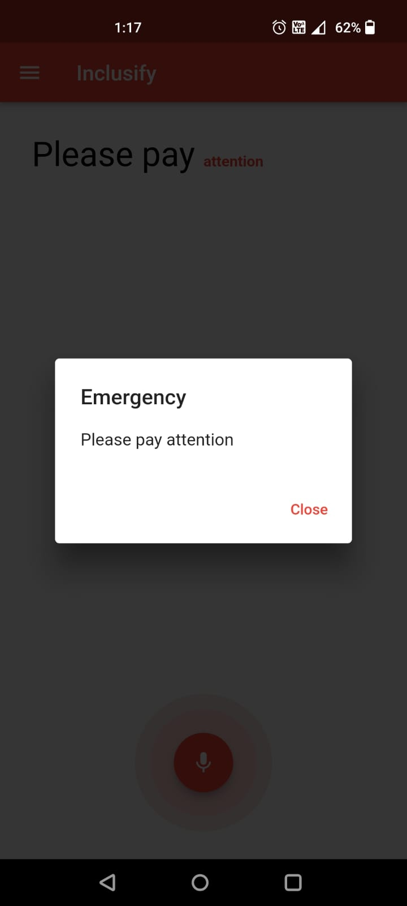

# Inclusify

## Table of Contents

- [Introduction](#introduction)
- [Features](#features)
- [Screenshots](#screenshots)
- [Usage](#usage)
- [Emergency Contacts](#emergency-contacts)

## Introduction

The **Inclusify** Flutter app is designed to assist hearing-impaired individuals during emergency situations by providing real-time transcription of spoken words and alert notifications. This app continuously listens to its surroundings, transcribes spoken words into text, highlights and vibrates for emergency announcements, and even activates the flashlight in case the user cannot feel the vibration. Additionally, it allows users to add emergency contacts who will receive SMS notifications when an emergency announcement is detected.

## Features

- Real-time speech-to-text transcription of surrounding conversations.
- Highlighting and vibrating alerts for emergency announcements.
- Flashlight activation for notification in case of no contact.
- Adding and managing emergency contacts.
- Automatic SMS notifications to emergency contacts during emergencies.

## Screenshots

    
    
    
    
    

*Landing page.*
*Real-time transcription of surrounding speech.*
*Detection of emergency important words.*
*Emergency alert notification with flashlight activation.*
*Emergency contacts management.*

## Usage

1. Launch the app on your Android device.

2. Grant the necessary permissions for microphone access.

3. The app will start transcribing surrounding conversations in real-time. You can see the text on the screen as people speak.

4. In case of an emergency announcement, the app will highlight the text, vibrate, and activate the flashlight if there is no contact with the device.

## Emergency Contacts

To add and manage emergency contacts:

1. Tap on the "Emergency Contacts" option in the app's menu.

2. Add the names and phone numbers of your emergency contacts.

3. In case of an emergency announcement, the app will send an SMS to these contacts with details of the announcement.